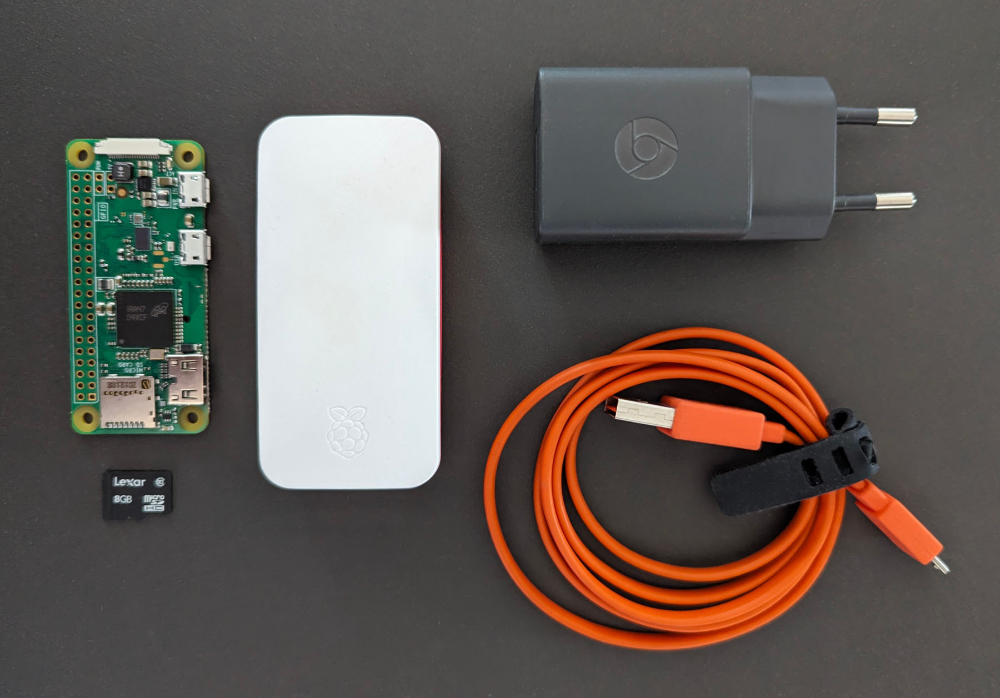

# Beginner's Guide for LMS on Raspberry Pi

!!! note
    This guide is primarily targeted at users that just use their Squeezeboxes for internet streaming. If you are looking for a more capable music system which can also serve local music, the Raspberry Pi model specified below is underpowered. If you want to serve local music, please use a Raspberry Pi 3B+ or better.

Were you an user of the now defunct MySqueezebox.com service and do you just want to continue listening to internet radio? Maybe a few podcasts too? You're not interested in having your own digital music collection at your fingertips? Just follow the steps below!

## Getting the hardware

These four parts are enough for your own inexpensive, energy-saving and long-lasting LMS Little Music & Radio Server.

- Raspberry Pi Zero 2 W
- Enclosure (make sure to choose one specifically for the Raspberry Pi Zero)
- Memory Card 8GB
- Power Adapter 5V 2A

[Here](https://www.raspberrypi.com/products/raspberry-pi-zero-2-w/#find-reseller){:target="_blank"} you can find a store in your area which sells these items. Some stores also sell these items as a bundle.

{ align=left }

Other Raspberry Pi models are suited as well (such as [3B+](https://www.raspberrypi.com/products/raspberry-pi-3-model-b-plus/#find-reseller), [4B](https://www.raspberrypi.com/products/raspberry-pi-4-model-b/#find-reseller), [5](https://www.raspberrypi.com/products/raspberry-pi-5/#find-reseller)), but please make sure you buy an enclosure and a power adapter that suits your model. The advantage of these models over the "Raspberry Pi Zero 2 W" is that they feature an ethernet port, which might suit your personal situation better (do not forget to also order an ethernet cable).

## Installing and configuring the software

For new users to Raspberry Pi and LMS the easiest way to LMS is to install [piCorePlayer](https://www.picoreplayer.org/) (pCP). There is [already great guide for pCP](https://docs.picoreplayer.org/getting-started/), but for clarity, below are the steps for this particular combination of hardware:

1. [Download piCorePlayer](https://docs.picoreplayer.org/how-to/download_picoreplayer/) (use the 32-bits variant)
2. [Burn pCP to the SD card](https://docs.picoreplayer.org/how-to/burn_pcp_onto_a_sd_card/)
3. [Setup WiFi](https://docs.picoreplayer.org/how-to/setup_wifi_on_pcp_without_ethernet/)
4. Eject the SD card and insert into the Raspberry Pi
5. Connect the power adapter to the Raspberry Pi

Congrats, piCorePlayer is now booting!

## After boot

After your new piCorePlayer has finished booting up, there are a few steps left to install and configure LMS:

1. [First determine the IP-address of the new piCorePlayer](https://docs.picoreplayer.org/how-to/determine_your_pcp_ip_address/). This IP-address is needed in the steps below.
2. Launch your web browser (eg. Edge, Firefox) and type: `http://[ip address from the previous step]:9000`. Then, press Enter. The piCorePlayer web interface will open.
3. Go to the Main Page tab, then to `Resize FS` in `Additional functions`.
4. Enter the value 2000 MB and click on `Resize`. Wait until the operation is complete (pCP may restart).
5. At the bottom left of the page, click on `Player/server`.
6. Go to the `LMS` tab, then click on `Install`.
7. In the `LMS` tab, click on `Start LMS` and wait for the operation to finish (pCP may restart). The `LMS is running` signal is ticked in green.
8. Confirm that the first line `Set Autostart` is set to `Yes`.
9. Go to the `Tweaks` tab and give a name (Host name) to the LMS server (for instance `lyrion`). This name will be used to connect the Squeezebox to the server.

If you need any help with the steps above, please check [this guide](https://docs.picoreplayer.org/how-to/install_lms/) for more pointers.

## Connecting your Squeezebox to LMS

The last step is to switch your Squeezebox device from MySqueezebox.com to your LMS instance. Turn on your Squeezebox, go to "My Music", then select "Switch library...", click on the server name defined above, and... that's it, your Squeezebox is connected to your LMS 24/7 !

## Troubleshooting

In case you encounter some problems please head over to the [forums](https://forums.slimdevices.com) for assistance. See also [this thread](https://forums.slimdevices.com/forum/user-forums/general-discussion/1668970-new-to-lms-get-help-here-installing-on-a-raspberry-pi/)  which specifically deals with helping newcomers installing LMS on a Raspberry Pi.
