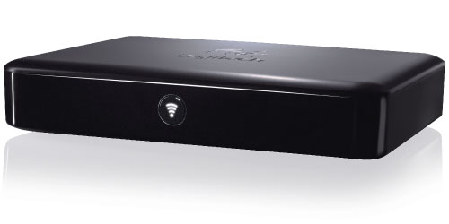

# Squeezebox Receiver

<figure markdown="span">
  { width="75%" }
</figure>

The Squeezebox Receiver (SBR), announced in January of 2008, is based on the Squeezebox2/v3 architecture, but lacks a display and headphone jack and is part of the Squeezebox Duet bundle, together with the Squeezebox Controller.

## Specifications

- CPU: Ubicom IP3K series, 250 MHz
- Dimensions: L: 156mm x W: 106mm (w/o connectors); 112.5mm (w/connectors) x H: 29.25mm
- Ethernet: True 100Mbps throughput; Shielded CAT5 RJ-45 connector; Connects to any 100Mbps or 10Mbps network; Auto-detects full duplex and half duplex modes; Automatic receive polarity correction; Maximum cable length: 100 meters (328 feet) + Auto Uplink (Auto MDIX)
- Wireless: 802.11g; supports WPA Personal, WPA2-AES and 64/128-bit WEP encryption; high speed PCI interface to radio module; bridging capability allows Ethernet devices to connect to the network through Squeezebox Wireless; dual internal antennas.
- Decoder: Software-based MP3, FLAC, Ogg Vorbis, WMA (except WMA Lossless), AIFF, WAV
- DAC: Wolfson® 24-bit WM8501, 44.1kHz & 48kHz
- Buffer RAM: 25Mb (approx. 200 seconds at 128Kbps) compresessed, plus 28Mb (10 seconds at 44.1 samples/sec) uncompressed
- ROM: Rewritable flash program memory, EEPROM configuration memory
- Power supply: 9V DC, regulated, center positive, sleeve ground. Connector: 1.05mm ID, 3.5mm OD, 7mm long. Min supply rating: 550mA
- Supported protocols: DHCP, ARP, IP, ICMP, UDP, Support for subnets/gateways (see documentation section on WANs), UDP-based SlimProto, TCP-based SlimProto and audio streaming, direct HTTP audio streaming, direct connection to MySqueezebox.com. Will automatically reconnect to LMS.
- Compatible with LMS/SBS version 7.0+. 
