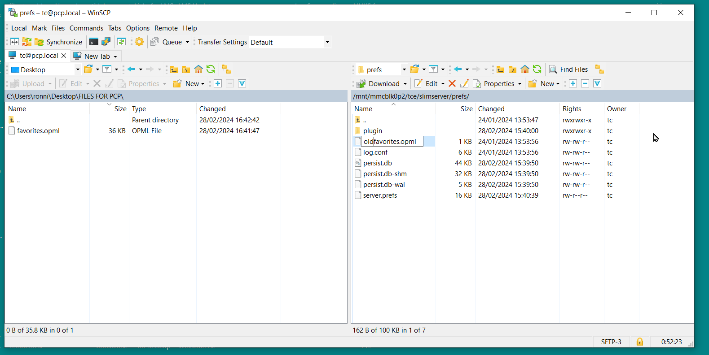
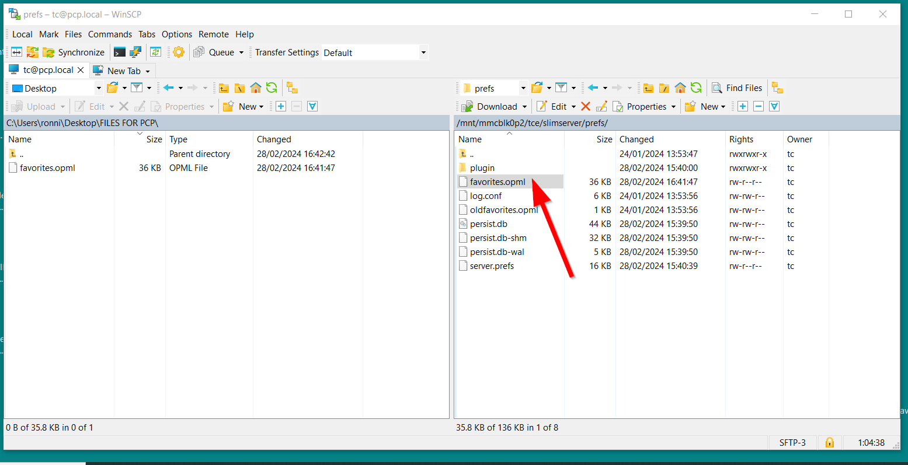
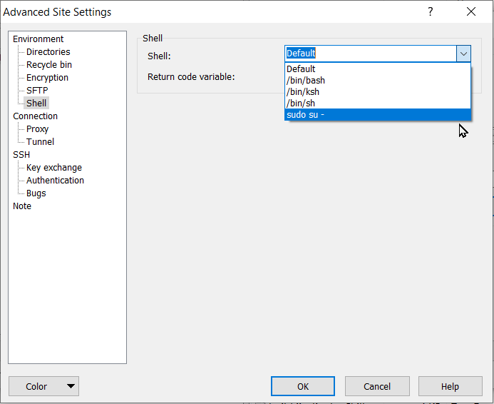

# How to transfer files using WinSCP

## Install WinSCP

[Download the latest version of WinSCP](https://winscp.net/eng/download.php) and install according to their instructions.

## Transfer a file

This is the method to transfer a opml file but it demonstrates the general procedure to transfer any file or folder e.g. music folders, if one does not use SMB.

!!! note
    This tutorial is written with a [piCorePlayer (or short pCP)](https://picoreplayer.org) as the remote machine. The same principles apply to any SSH server. Change machine- and/or username as needed.

* Both the Windows computer and the Raspberry Pi have to be on the same network.

* On the Windows computer make a new folder on the desktop and paste the favourites.opml inside

!!! tip
    When one starts WinSCP for the first time one is given the option to start in two different modes; we recommend the one that gives two panes side by side.

* Stop LMS from running (on pCP you find the button on the LMS tab page)

* Leave the File Profile at SFTP (Note; this setting can be changed, but for pCP it seems to work without a problem)

* Then Log in to the Raspberry Pi, you need the IP address (or use its host name, like eg. pcp.local)

* Leave the port # at 22

* Enter the user name (which on pCP is `tc` by default)

* Enter the user password (pCP: `piCore` by default)

* Click on Login

* When the Warning Box appears click on Update

You are presented with two screens:

The one on the left is the Windows computer you are using and the one on the right the remote machine (a Raspberry Pi with pCP).

* In the Left Pane, select the location from the dropdown and then double click on the rewuired folder to open it.

* In the right pane select `<root>` from the dropdown

* From the list that appears below, navigate to `/usr/local/slimserver/prefs`

And this is where we go; one can either overwrite or rename the existing `favourite.opml` to `oldfavourite.opml` (I choose the latter; right click on the folder and click on rename from the dropdown).

* Then in the left pane right click on the folder and choose upload from the dropdown.

* Then click on OK in the box that appears

The file is uploaded.

Close WinSCP (click yes on the Termination warning box) and reboot the Pi.

## Transfer a file as user `root`

Normally I use SFTP or SCP as File Protocal but sometimes one is denied permission to perform the task and one needs to utilise the user `root`.

* Fill in the login detail as required and then click on Advanced

* In the window that opens click on the following areas in sequence: "Shell"

* then "`sudo su`" from the dropdown

* then on OK

* The window will close and then click on Login

This is a rpi 4B with LMS installed on the Raspberry Pi OS Bookworm Lite 64 bit:

